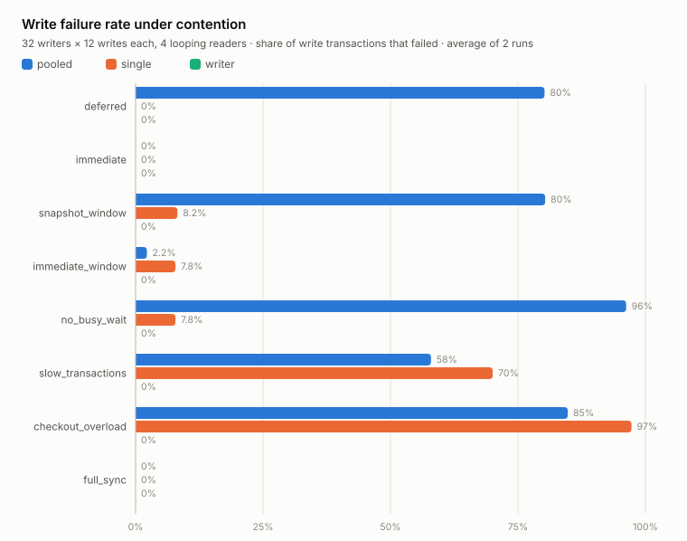
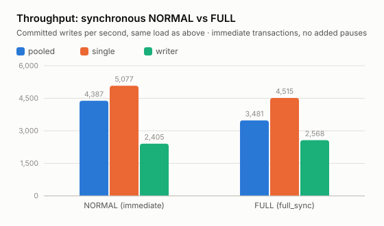

# SQLite concurrency with Elixir and Ecto

A small lab for measuring **when database operations fail** under concurrent reads
and writes, and how connection strategy changes those failures. The generic
workload updates a counter and records an event in the same transaction.
Failed operations are counted without retries; every acknowledged write is audited.

## Connection strategies

| Strategy | Write path | Read path |
|---|---|---|
| `pooled` | Ecto pool with 5 connections | Same pool |
| `single` | Ecto pool with 1 connection | Same connection |
| `writer` | GenServer → write repo with 1 connection | Separate pool with 4 connections |

All strategies share one SQLite file in WAL mode. The question is where requests
wait, which calls fail, how long they take, and whether acknowledged data survives.

## The workload and what `delta` detects

The database holds two tables: an `events` log (one row per write) and a
`counters` table with a single row. Every write transaction does three things in
sequence: it reads the current counter value, writes back `value + delta`, and
inserts an event row recording which writer did it, which attempt it was, and
the delta it applied. So `delta` is simply "how much this write adds to the
shared counter".

This read-then-write pattern is the classic lost-update detector. If two
transactions interleave badly — both read the counter at 10, both write back
`10 + delta` — one update silently vanishes from the counter while both event
rows remain. The lab's core invariant is therefore: **the counter must always
equal the sum of all deltas in the event log.** Readers check this on every
snapshot during a run, and the audit after each run checks it again, together
with the full event list against the acknowledged writes. If SQLite's locking
ever allowed a torn read-modify-write under any strategy, this is where it
would show up. The generated correctness cases draw `delta` at random from a
wide range (including negative values), so a lost or doubled update cannot
hide behind a coincidental or zero-valued sum.

## Run

Use Elixir 1.17+ with compatible Erlang/OTP. The optional Nix flake supplies the
runtime and build tools on macOS/Linux (`nix develop`, or direnv).

```sh
mix deps.get
mix test
mix run bench/concurrency.exs
# Optional destination for the evidence files:
mix run bench/concurrency.exs results/my-device
# Re-render the README charts from a sweep folder:
mix charts results/my-device
```

`mix test` prints measured failure counts and latency for contention, checkout
overload and an external writer lock, followed by recovery after lock release.
Deterministic conflict/rollback/snapshot/crash tests and 100 generated correctness
cases per strategy remain. Only those generated correctness cases deliberately use
`BEGIN IMMEDIATE` and a generous checkout budget to check the no-loss invariant.
The measurements allow failures; passing tests do not mean all DB calls succeeded.

For a sense of scale: each generated case runs up to 16 concurrent writers × 64
writes plus up to 16 looping readers, so one `mix test` run commits roughly
80,000 write transactions across the three strategies — and the audit checks
every one of them row by row (writer identity, attempt number, delta, payload,
and the counter total), while every reader snapshot is checked for consistency
as it is taken. A passing property here is not a handful of examples; it is
tens of thousands of individually verified transactions under real concurrency.

## Measurement sweep

The sweep covers 1/8/32 writers × 0/4 continuously looping readers × three
strategies × eight scenarios × two repeats: **288 runs**. Each writer attempts
12 transactions. Change the constants in `bench/concurrency.exs` or the small
scenario list in `lib/sqlite_lab/experiment.ex` to probe a different load.

| Scenario | Transaction | Change from the baseline |
|---|---|---|
| `deferred` | Deferred | Driver-style defaults: NORMAL, 2,000 ms busy timeout, checkout target 50 ms / interval 1,000 ms |
| `immediate` | Immediate | Only transaction mode changes |
| `snapshot_window` | Deferred | Pause 5 ms between reading and updating the counter |
| `immediate_window` | Immediate | Same 5 ms pause, for a matched mode comparison |
| `no_busy_wait` | Immediate | Same 5 ms pause, busy timeout 0 ms |
| `slow_transactions` | Immediate | Pause 25 ms with the ordinary checkout settings |
| `checkout_overload` | Immediate | Same 25 ms pause, checkout target 1 ms / interval 10 ms |
| `full_sync` | Immediate | Synchronous FULL on the actual temporary-file storage |

The scenarios vary four knobs, in plain words. **Transaction mode**: a deferred
transaction starts as a read and upgrades to a write when needed — that upgrade
is what fails under contention; an immediate transaction takes the write lock up
front. **Busy timeout**: how long SQLite itself keeps retrying a locked file
before giving up. **Checkout target/interval**: how long Ecto lets a process
wait for a pool connection before rejecting it. **Synchronous**: how hard each
commit is pushed to physical storage before being acknowledged (measured under
"What durability costs" below).

Each run writes three evidence files:

- `measurements.csv`: settings, successful/failed writes and reads, error rates,
  throughput, separate success/failure p50/p95/p99/max latency, sampled mailbox and
  BEAM memory peaks, and the audit result.
- `errors.csv`: every distinct observed exception message and reported SQL statement,
  grouped by run, operation and error type, with occurrence counts.
- `environment.txt`: SQLite/Elixir/OTP/dependency versions, scheduler counts and matrix.

Rows are appended after each case. An unexpected exception, task exit or audit
mismatch stops the sweep and writes `fatal.txt`; previous rows remain available.
Fresh temporary databases are closed and removed. Set `TMPDIR` to choose the tested
storage. New default run folders are ignored by Git. One measured example is kept
under [results/example](results/example); see [results/README.md](results/README.md).

## Measured results

The charts below come from one sweep kept under
[results/example](results/example), collected on an Apple M5 MacBook with 24 GB
of memory and its local SSD. Absolute numbers are specific to that machine —
rerun the sweep on your own hardware, especially on the storage you will
actually use, before drawing conclusions. The SVGs are rendered straight from
`measurements.csv` by `mix charts <folder>`, so they can be regenerated for
any sweep.

<picture>
  <source media="(prefers-color-scheme: dark)" srcset="results/example/charts/failure-rates-dark.svg">
  
</picture>

Notice the abscence of green bars here. If you look to the bottom of the
graph you see a bunch zeroes: the writer strategy never fails a write. The pooled strategy loses most of its writes whenever transactions are deferred or slow, and the single-connection pool starts rejecting checkouts as soon as transactions take real time. 

It is tempting to read this as "writer wins" — and for the kind of system this lab
was built around, it does — but it is important to understand why, and under
which premises. The writer never says no because it queues every request and
makes the caller wait; nothing here is a free lunch. In the slow-transaction
scenarios all three strategies commit the same ~38 writes per second, because
the bottleneck is the transaction itself. The strategies differ only in what
happens to work that cannot run yet: fail it, or hold it.

Which answer is right depends on where the writes come from. If they are
requests arriving from an open-ended outside source — a web page, say —
rejecting some when pressure is high is often the healthier choice, because
every queued request costs memory and the queue has no natural bound. The
writes in the system behind this lab are a device's own events: configuration
changes and sensor readings produced by a fixed set of internal processes. The
queue is bounded by the number of producers — the measured mailbox peak of 31
under 32 writers shows exactly that — and the data is deemed important:
throwing events away because there is momentarily too much load is precisely
what we do not want. Under those premises, making the producer wait is the
correct form of back-pressure, and the writer's clean column is a real result,
not an accounting trick.

### What durability costs: synchronous NORMAL vs FULL

SQLite's `synchronous` setting decides how hard each commit is pushed to disk.
At NORMAL — the lab's default and the common recommendation with WAL — a sudden
power cut can lose the last moments of committed writes; the database stays
uncorrupted, but recent commits may be gone. At FULL, every commit is flushed
to storage before being acknowledged, closing that window at a latency price.

<picture>
  <source media="(prefers-color-scheme: dark)" srcset="results/example/charts/sync-throughput-dark.svg">
  
</picture>

On this machine's SSD the price was barely measurable. Do not read that as
"FULL is free": flash storage on embedded devices often has sync latency that
is orders of magnitude worse — and spikier — than a laptop SSD. This chart is
an argument for measuring on the target device, not a verdict. The same chart
also shows the writer strategy's own cost: funneling every write through one
process roughly halves peak throughput against the single-connection pool.
That headroom is the price paid for the clean failure column above, and it only
matters if the event rate ever approaches it.

## Interpretation

- Deferred transactions can fail when upgrading a read snapshot. Immediate mode
  moves contention to transaction entry; it does not remove all lock failures.
- `pool_size: 1` can reject checkout requests under overload. Writer queues them
  in an **unbounded mailbox with infinite caller waits**. Fewer rejections alone
  do not establish safer overload behavior. Readers share checkout contention in
  Direct, while Writer's readers use a separate pool.
- The external-lock tests show that Writer can also receive SQLite errors. A kill
  test checks that a crashed Writer restarts, rolls back its in-flight job and
  tells the waiting caller; that is still not a general supervision or
  power-loss test.
- Latency percentiles are histogram upper bounds. Sampling every 50 ms can miss
  peaks; BEAM memory excludes native SQLite allocations. Direct mailbox zeros mean
  no Writer is attached, not that DBConnection has no queue. Error grouping retains
  messages/statements, not numeric extended SQLite codes absent from Exqlite.Error.
- Readers scan the event log until writes finish, so achieved read demand varies
  between strategies. Throughput includes reader drain, excludes setup/audit, and
  compares this mixed workload. Runs use fresh files and no explicit warmup.
- Pauses widen transaction windows; they do not emulate fsync latency. FULL tests
  the chosen storage. NORMAL and orderly reopen do not establish power-loss durability.

## References

[SQLite WAL](https://sqlite.org/wal.html) · [isolation](https://sqlite.org/isolation.html) ·
[Ecto SQLite3](https://ecto-sqlite3.hexdocs.pm/Ecto.Adapters.SQLite3.html) ·
[Exqlite](https://exqlite.hexdocs.pm/Exqlite.Connection.html) ·
[DBConnection](https://hexdocs.pm/db_connection/DBConnection.html)

MIT licensed; see [LICENSE](LICENSE). This is a generic experiment, not a production
architecture recommendation or a reproduction of any particular application.
